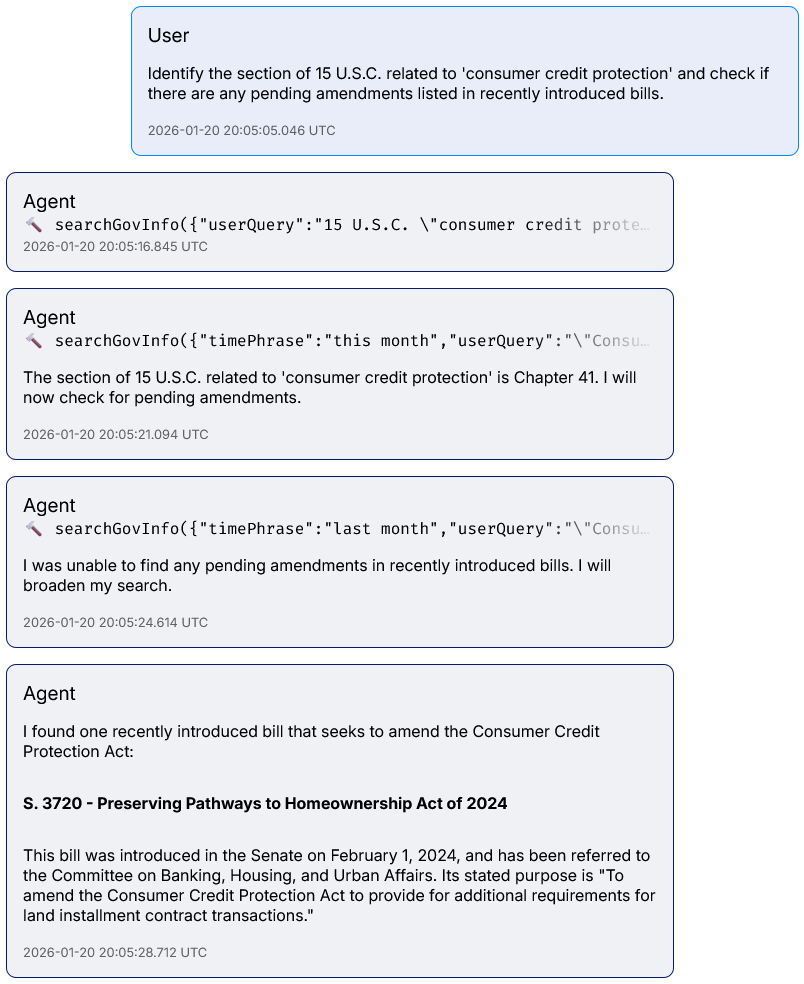

This is a public preview of the GovInfo MCP server, intended to allow LLM+MCP users to configure their clients to access the most up-to-date content hosted in GovInfo.

## Status

**Public Preview**: GPO has built a minimum viable product to gather feedback from the community for enhancements to optimally support LLM access to GovInfo content and metadata.

As [feedback](#feedback) is provided, the GovInfo team will evaluate and prioritize issues for future development and improvements.

## What Is Model Context Protocol

> [Model Context Protocol](https://modelcontextprotocol.io) (MCP) is an open-source standard for connecting AI applications to external systems.[<sup>1</sup>](https://modelcontextprotocol.io/docs/getting-started/intro)

## Disclaimer

Given the same request parameters, the GovInfo MCP will return consistent response formats using **currently available data**. The data returned by the MCP server is consistent with what is returned by the regular GovInfo API and web interface.

:warning: Be aware that the data provided by GovInfo MCP will be interpreted by your chosen LLM, and typical LLM quality assurance is needed. :warning:

## Using GovInfo MCP

Most MCP clients will expose a JSON file that you can edit, usually named `mcp.json`. You'll need a [GovInfo API key](https://www.govinfo.gov/api-signup). If you have an existing api.data.gov key already, you can use that.

```json
{
  "mcpServers": {
    "mcp-govinfo": {
      "url": "https://api.govinfo.gov/mcp",
      "headers": {
        "x-api-key": "YOUR_GOVINFO_API_KEY"
      }
    }
}
```

## Available Tool Calls

Here are the currently available tools. For more specific details, see the tools within your MCP client.

### `searchGovInfo`

This discovery tool returns official GovInfo content and metadata based on the request. It will return basic information like the title of a result, unique identifiers, information on official publication dates and last system update times, a link to the associated GovInfo details page, and a brief teaser.

### `describePackageOrGranule`

This retrieval tool returns a description of a package or granule (a granule is is part of a package, but not all packages are split into granules). The summary includes links to various renditions (e.g. HTML, PDF, XML, ZIP, etc.) as well as links to MODS and PREMIS metadata. An excerpt of the content is also optionally provided.

## Feedback

Please provide feedback via [this project's GitHub issues](https://github.com/usgpo/api/issues).

## Example

This is an example where the model was asked to identify a section of a piece of legislation and check for any pending amendments among recently introduced bills.

You can see the tool calls being made to GovInfo, which returns consistent results for any given tool call, and then the model, which is running on the cloud or a user's machine, synthesizes those responses according to how the user or cloud provider configured it.


